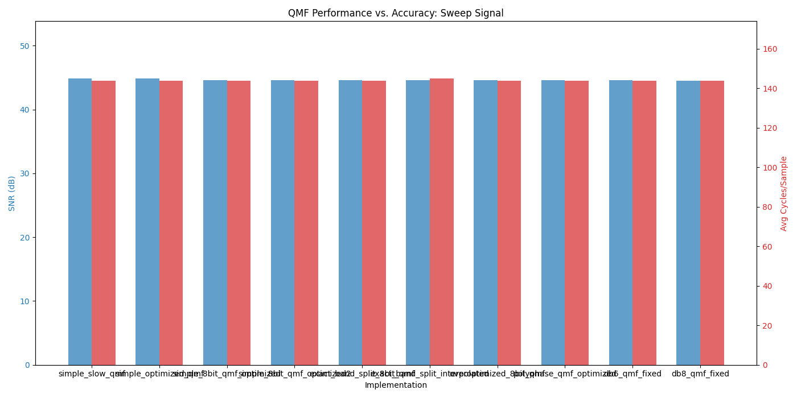
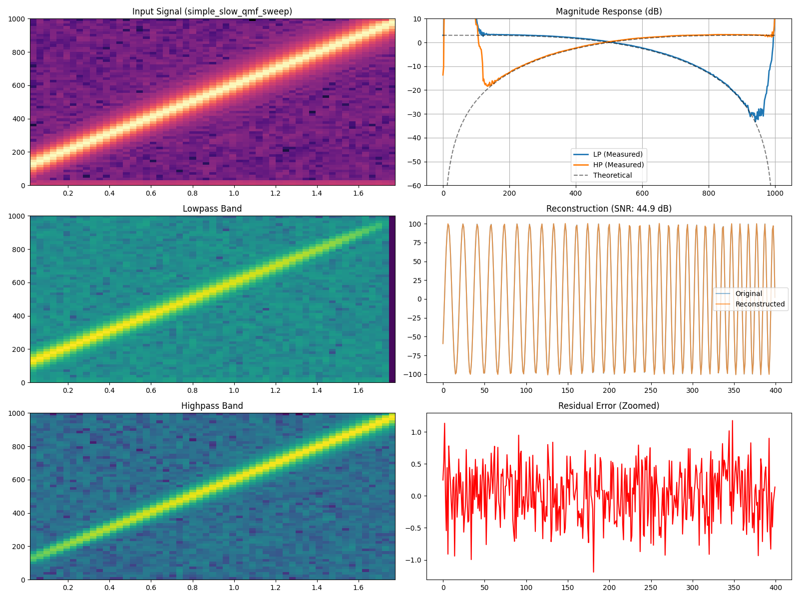
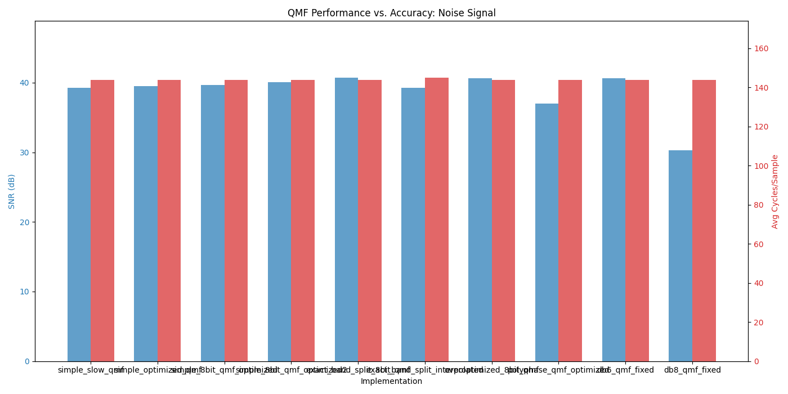
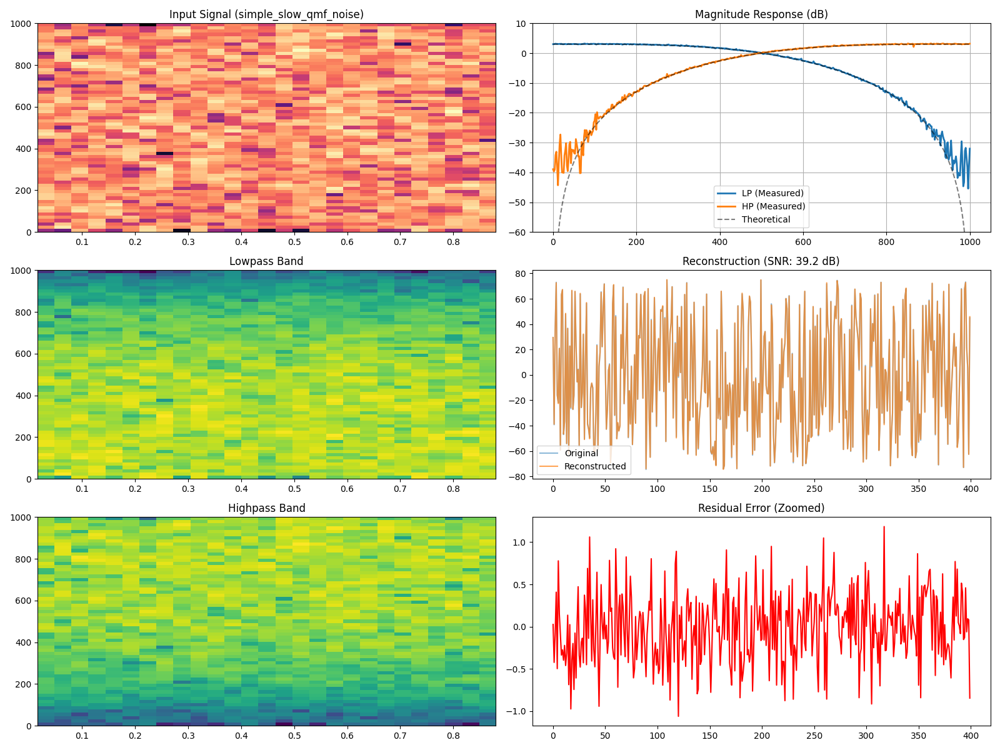
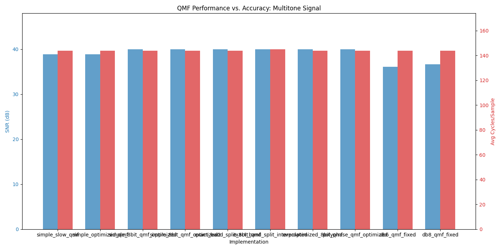
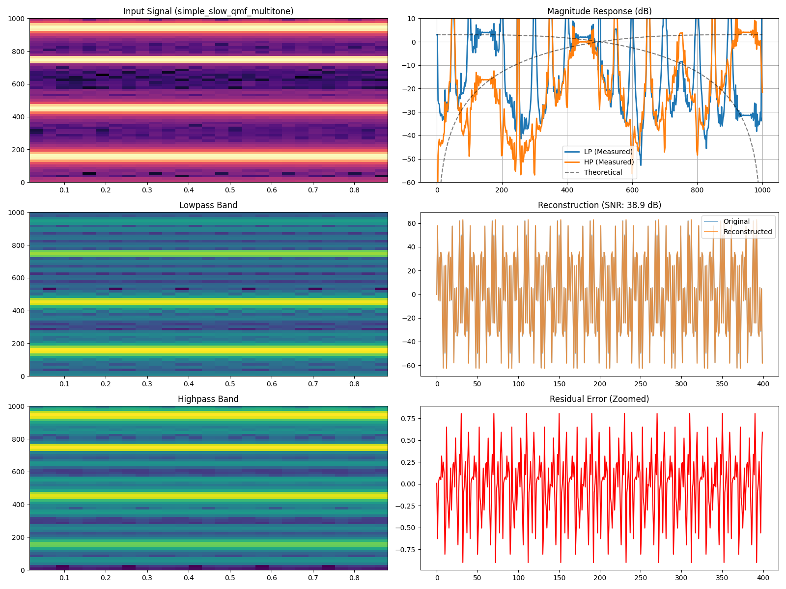
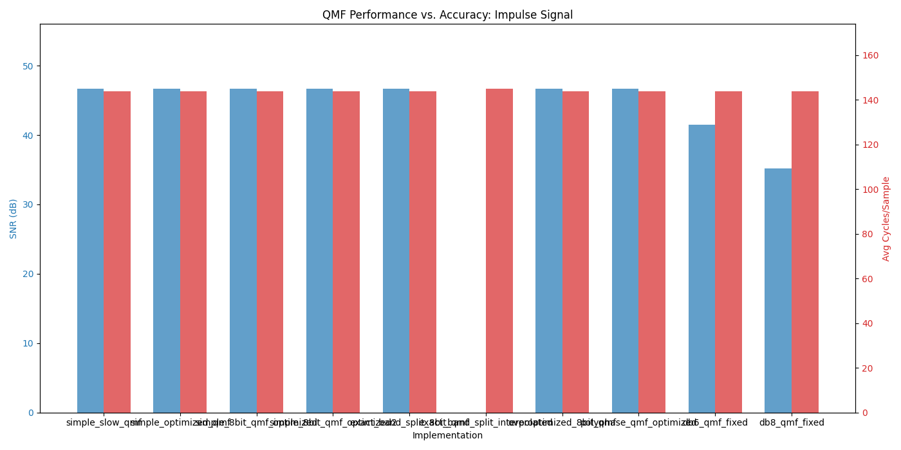
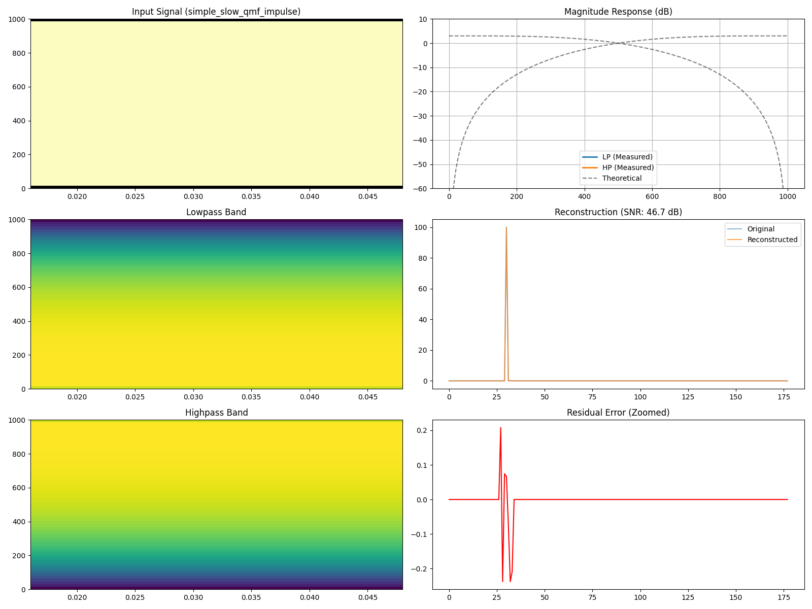

# Arduino QMF Experiments: Performance vs. Accuracy

This repository contains multiple implementations of **Quadrature Mirror Filters (QMF)** for the Arduino platform, using the Daubechies 4 (DB4), DB6, and DB8 wavelet coefficients. The project explores the trade-off between computational complexity and signal reconstruction fidelity across various signal types.

## QMF Implementation Variants

### 1. `simple_slow_qmf.ino` (Baseline)
- **Approach**: Standard floating-point convolution.
- **Characteristics**: High precision, serves as the gold standard for filtering logic.

### 2. `simple_optimized_qmf.ino` (10-bit Fixed Point)
- **Approach**: 16-bit fixed-point math with 32-bit accumulators.
- **Optimization**: Uses rounding before bit-shifting to preserve SNR. Designed for 10-bit input (standard Arduino `analogRead`).

### 3. `simple_8bit_qmf_optimized.ino` (High SNR 8-bit)
- **Approach**: Optimized for 8-bit systems. Achieves high SNR (~44dB) by maximizing the use of the dynamic range within 16-bit constraints.

### 4. `exact_band_split_interpolated.ino` (Dynamic)
- **Approach**: Real-time interpolation of filter coefficients based on a sampling rate knob.
- **Optimization**: Knob polling is throttled (every 100 samples) to minimize CPU overhead while allowing real-time adjustments.

### 5. `overoptimized_8bit_qmf.ino` (Peak Performance)
- **Approach**: Hand-unrolled FIR calculation with SRAM-buffered coefficients to minimize PROGMEM read overhead.

### 6. `db6_qmf_fixed.ino` & `db8_qmf_fixed.ino` (Higher Order)
- **Approach**: Daubechies 6 (6-tap) and Daubechies 8 (8-tap) filters for improved spectral separation.

---

## Test Results by Signal Type

The following sections show the performance of the implementations across different test signals.

### Sweep (Chirp) Signal
Tests frequency response from 10Hz to 1000Hz.

*Typical Analysis:*


### White Noise Signal
Tests the statistical reconstruction of a random spectrum.

*Typical Analysis:*


### Multi-tone Signal
Tests behavior with multiple discrete frequencies (150, 450, 750, 950 Hz).

*Typical Analysis:*


### Impulse Response
Tests time-domain characteristics and reconstruction of sharp transients.

*Typical Analysis:*


---

## DSP Test Framework

The project includes a robust testing suite to verify filter behavior without physical hardware.

### Features
- **Mock Arduino**: C++ environment simulating `analogRead`, `analogWrite`, `micros()`, and Timer interrupts.
- **Signal Generation**: Support for Sweeps (Chirp), Noise, Impulses, and Multi-tone signals.
- **SNR Analysis**: Searches for optimal delay and gain to calculate the best possible reconstruction SNR.
- **Visualization**: Automated generation of Spectrograms, Transfer Function Magnitude plots, and performance comparison charts.

### Usage
Run the full test and visualization pipeline:
```bash
python3 test_runner.py
python3 generate_comparison_plots.py
```
