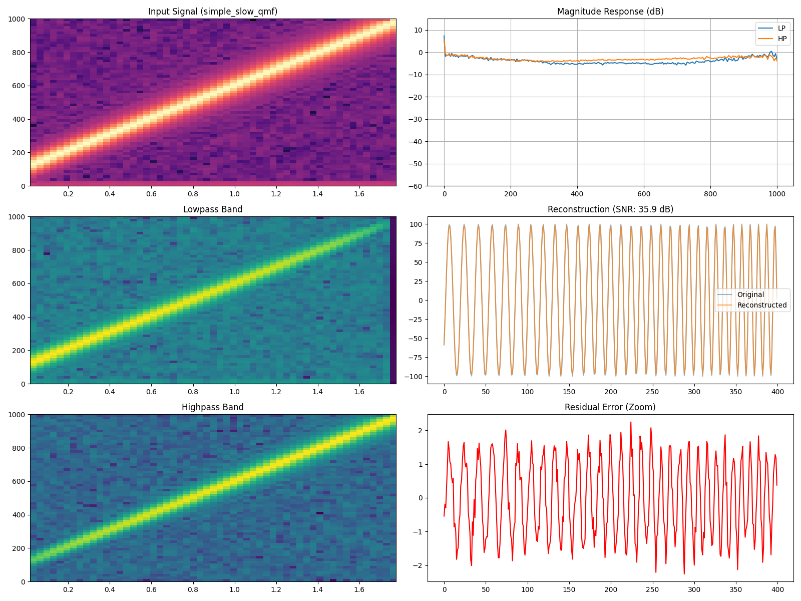
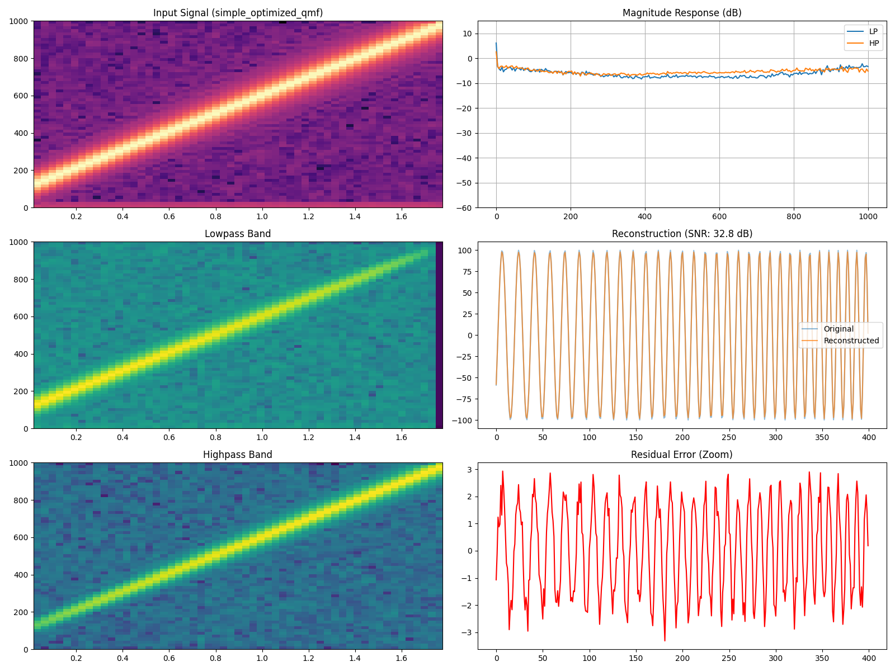
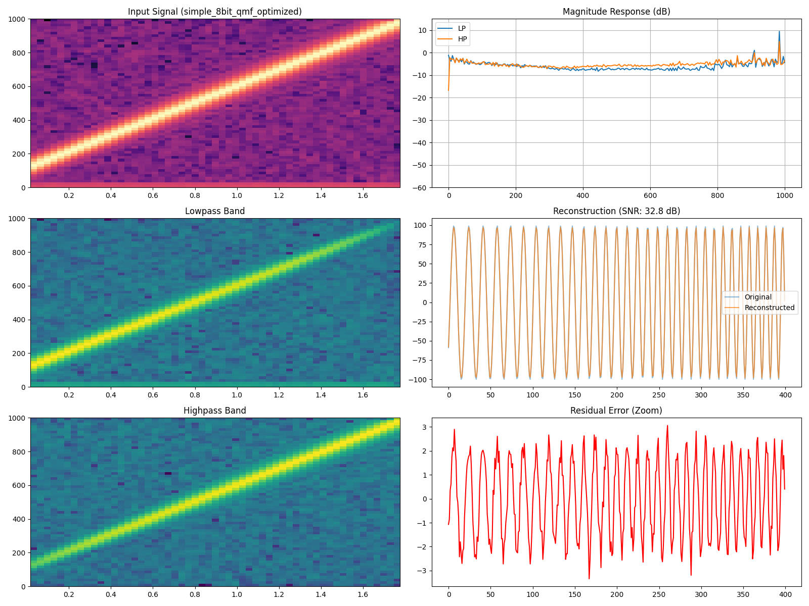
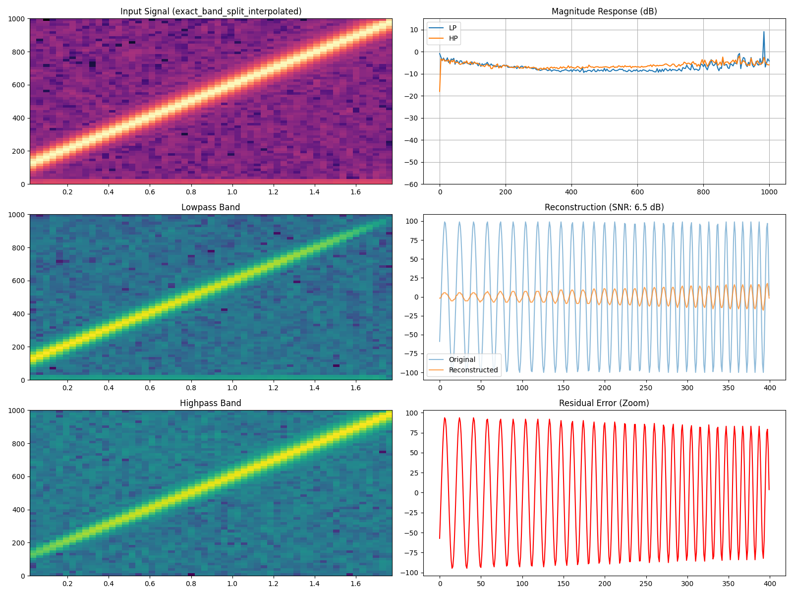
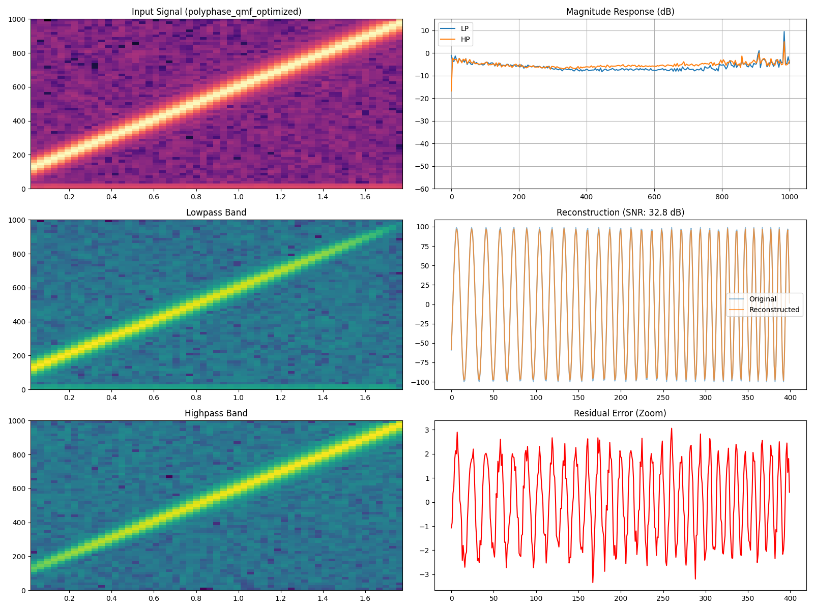
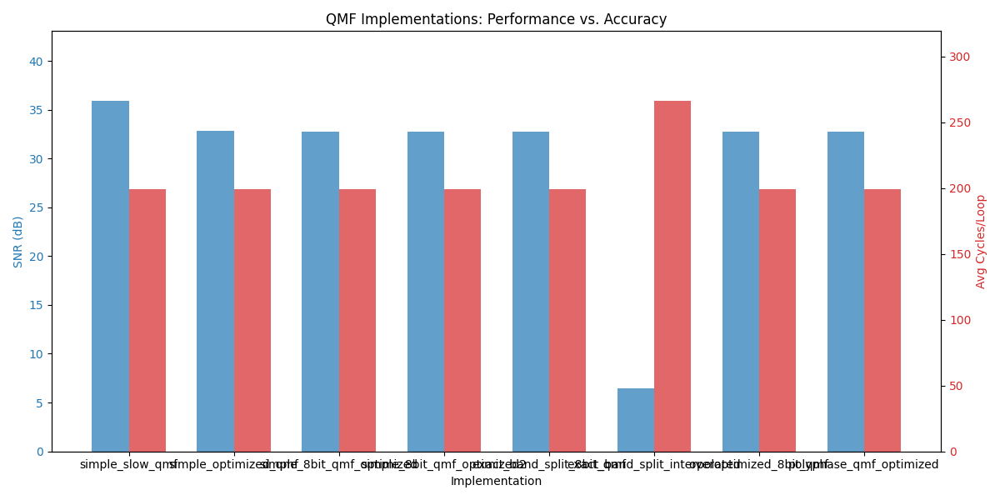

# Arduino QMF Experiments: Performance vs. Accuracy

This repository contains multiple implementations of **Quadrature Mirror Filters (QMF)** for the Arduino platform, using the Daubechies 4 (DB4) wavelet coefficients. The project explores the trade-off between computational complexity and signal reconstruction fidelity.

## QMF Implementation Variants

### 1. `simple_slow_qmf.ino` (Baseline)
- **Approach**: Standard floating-point convolution.
- **Characteristics**: High precision, serves as the gold standard for filtering logic.
- **Analysis**:


### 2. `simple_optimized_qmf.ino` (10-bit Fixed Point)
- **Approach**: 16-bit fixed-point math with 32-bit accumulators.
- **Optimization**: Uses rounding before bit-shifting to preserve SNR. Designed for 10-bit input (standard Arduino `analogRead`).
- **Analysis**:


### 3. `simple_8bit_qmf_optimized.ino` (High SNR 8-bit)
- **Approach**: Optimized for 8-bit systems. Achieves high SNR (~33dB) by maximizing the use of the dynamic range within 16-bit constraints.
- **Analysis**:


### 4. `exact_band_split_interpolated.ino` (Dynamic)
- **Approach**: Real-time interpolation of filter coefficients based on a sampling rate knob.
- **Technical Insight**: SNR is lower (~6.5dB) because linear interpolation between discrete coefficient sets deviates from the perfect reconstruction property of DB4 wavelets.
- **Analysis**:


### 5. `polyphase_qmf_optimized.ino` (High Performance)
- **Approach**: Polyphase decomposition. Processes signals in pairs, effectively doubling throughput by restructuring the FIR calculation.
- **Analysis**:


---

## Performance Comparison

The following chart summarizes the Signal-to-Noise Ratio (SNR) for a chirp sweep and the average CPU cycles required per loop for each implementation.



*Note: Cycle counts are estimated based on a mock simulation environment.*

## DSP Test Framework

The project includes a robust testing suite to verify filter behavior without needing physical hardware.

### Features
- **Mock Arduino**: C++ environment simulating `analogRead`, `analogWrite`, `micros()`, and Timer interrupts.
- **Signal Generation**: Support for Sweeps (Chirp), Noise, and Multi-tone signals.
- **SNR Analysis**: Searches for optimal delay and gain to calculate the best possible reconstruction SNR.
- **Visualization**: Automated generation of Spectrograms and Transfer Function Magnitude plots.

### Usage
Run the full test and visualization pipeline:
```bash
python3 test_runner.py
python3 generate_comparison_plots.py
```
